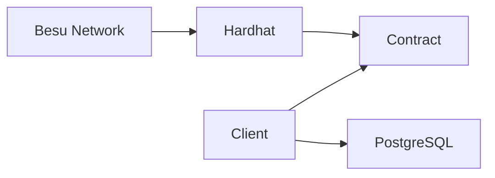

<div align="center">

# GoLedger Challenge - Besu Client


Simple HTTP REST API client to interact with a Besu blockchain network and an SQL database implemented in Golang that exposes functionalities as REST API.

</div>

## Installation

### Requirements

First, keep in mind that this client depends on the previous installation of the besu infrastructure. Therefore, before starting the installation, make sure that you have set up `/besu` by carefully following the installation guide.

If you have completed all the steps correctly, you can continue with the client installation.

### Prerequisites

- Golang SDK v1.23 or higher (https://go.dev/)
- Air - Live reload for Go apps (https://github.com/air-verse/air)
- Docker and Docker Compose (https://www.docker.com/)
- Any code editor, in this case I recommend VS Code (https://code.visualstudio.com/)

### Set up the environment

First, setup the environment variables file for the application.

```sh
cp .env.example .env
```

Note that some environment variables need to be added as your Besu environment has been properly configured.

```sh
GIN_PORT=":8080"
GIN_MODE="debug"

DB_HOST="localhost"
DB_PORT=5433
DB_DATABASE="goledger_challenge_besu"
DB_USERNAME="gabriel"
DB_PASSWORD="Secret123456@"

# You could found this value in besu/artifacts/SimpleStorage.json
# You should get the value of key "abi", for better usage minify it
SIMPLE_STORAGE_ABI=
# This is the network URL binding your host to Besu in container
SIMPLE_STORAGE_NETWORK_URL="http://127.0.0.1:8545"
# You could find this in genesis/genesis.json, any of private keys will work
SIMPLE_STORAGE_PRIVATE_KEY=
# This contract address is showed after the infra setup (in the final of ./startDev.sh execution, pay attention)
SIMPLE_STORAGE_CONTRACT_ADDRESS=
```

After configuring your environment variables, start the Postgres container to have the local database properly up and running.

```sh
docker compose up -d
```

After this step, tidy up the application dependencies using the command below.

```sh
go mod tidy
```

In the development environment you can use Air to have an environment with hot reload, but the application can still be used without Air installed.

```sh
# with Air
air

# without Air
go run cmd/client/main.go
```

If your application has been correctly configured and has downloaded the dependencies without any issues, the application should start and list the application's main routes without any problems. The message to be displayed will be close to the message below (it may vary depending on the shell environment depending on your Linux flavor or OS)

```sh
# After running `air`

[GIN-debug] [WARNING] Creating an Engine instance with the Logger and Recovery middleware already attached.

[GIN-debug] [WARNING] Running in "debug" mode. Switch to "release" mode in production.
 - using env:   export GIN_MODE=release
 - using code:  gin.SetMode(gin.ReleaseMode)

[GIN-debug] GET    /ping                     --> github.com/eng-gabrielscardoso/goledger-challenge-besu/internal/routes.SetupRouter.func1 (3 handlers)
[GIN-debug] GET    /simple-storage/          --> github.com/eng-gabrielscardoso/goledger-challenge-besu/internal/controllers.(*TransactionController).GetValue-fm (3 handlers)
[GIN-debug] POST   /simple-storage/          --> github.com/eng-gabrielscardoso/goledger-challenge-besu/internal/controllers.(*TransactionController).SetValue-fm (3 handlers)
[GIN-debug] POST   /simple-storage/sync      --> github.com/eng-gabrielscardoso/goledger-challenge-besu/internal/controllers.(*TransactionController).SyncTransaction-fm (3 handlers)
[GIN-debug] POST   /simple-storage/check     --> github.com/eng-gabrielscardoso/goledger-challenge-besu/internal/controllers.(*TransactionController).CheckTransaction-fm (3 handlers)
[GIN-debug] Listening and serving HTTP on :8080
```

For this application we recommend that you use Visual Studio Code because, through the REST Client extension (https://marketplace.visualstudio.com/items?itemName=humao.rest-client) it is possible to make HTTP calls to the API in a simple way through the `routes.http` file.

If you still don't want to use it, you can use any IDE of your choice and REST Client such as Postman (https://www.postman.com/) or Insomnia (https://insomnia.rest).

In the end, you will be able to enjoy the operations through the client's HTTP calls. 🌟

### Possible issues

1. **I am unable to interact with the Blockchain through the REST Client**: Check your environment variables to ensure that none of them are in conflict with the variables expected by the client.
2. **I can't run the `air` command**: This problem may occur because you have not installed the `air` binary in your local environment (double check to make sure you have done everything as shown in the documentation) or possibly your `GOPATH` is not set correctly. In some cases, you just need to adjust your `GOPATH` so that the command is discovered by Go and executed correctly.

Any more specific issues? Please open an issue or contact the developer so we can take a look at the problem! 😉

## Architecture



The application architecture is quite simple, consisting of an infrastructure made with Besu network where a smart contract developed with Solidity and Hardhat is deployed through the Besu network called `SimpleStorage`.

This contract exposes some functions to be consumed through the REST Client through HTTP calls. Some of its operations can interact with a PostgreSQL database to store some data from the state stored in the blockchain.

All interactions with database were made using an ORM (object relational mapping) to abstract the SQL and concentrate in Go language. The main entity is the `transaction` that is all about the representation of the state of `SimpleStorage` state in blockchain.

In summary this is all about architecture of application.

## Author

This project is authorised by [Gabriel Santos Cardoso](https://gabrielscardoso.com) as part of [Goledger Challenge Besu](https://github.com/GoLedgerDev/goledger-challenge-besu).
